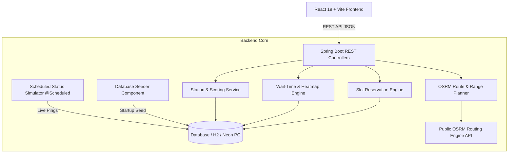
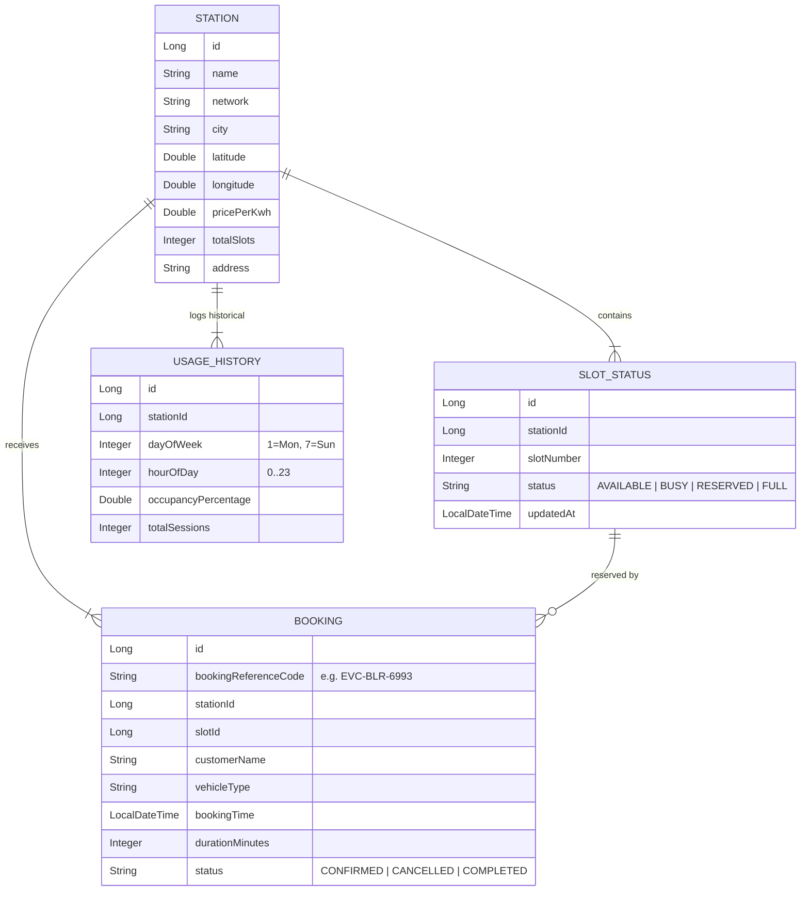

# EVConnect India ⚡
> **Predictive EV Charging Network — Station Finder, Slot Reservation & Trip Planner for Bangalore, India**

---

## 1. Executive Summary & Vision

### 1.1 The Core Problem
India is witnessing an exponential surge in Electric Vehicle (EV) adoption, with over 1.4 million EVs registered across two-wheelers, three-wheelers, and passenger cars. However, India currently operates approximately 12,000+ public EV charging stations. 

The primary barrier to EV adoption is no longer just **"Range Anxiety"** (*where is the nearest charger?*), but **"Queue & Wait Anxiety"** (*will I be stuck waiting 40 minutes when I arrive?*). 

Existing navigation tools (Google Maps, static aggregator apps) only show charger locations and static status tags. They fail to inform drivers whether a charger will actually be free when they arrive or how long they will need to wait in line during peak commute hours.

### 1.2 The Solution: EVConnect India
**EVConnect India** is a real-time, predictive EV charging station discovery, booking, and trip-planning platform engineered specifically for Indian urban and intercity mobility. Built around Bangalore's tech corridors, EVConnect India transitions the paradigm from static mapping to **predictive queue management**.

```
┌─────────────────────────────────────────────────────────────────────────────┐
│                            EVCONNECT INDIA VISION                            │
├───────────────────────────────┬─────────────────────────────────────────────┤
│ Legacy Map Apps               │ EVConnect India                             │
├───────────────────────────────┼─────────────────────────────────────────────┤
│ "Charger located 3.2 km away" │ "3.2 km away — 4/6 slots free — 0 min wait" │
│ "Status: Unknown / Static"    │ "Peak rush expected at 6:00 PM (85% busy)"  │
│ "Arrive & Hope"               │ "Pre-reserve slot with instant reference ID" │
└───────────────────────────────┴─────────────────────────────────────────────┘
```

---

## 2. Technical Stack & Architecture

EVConnect India is built on a decoupled, microservices-ready architecture using Spring Boot for backend telemetry and business logic, and React + Vite for a high-performance, constructivist frontend UI.



### 2.1 Technology Stack Matrix

| Layer | Technology | Purpose & Details |
|---|---|---|
| **Backend Framework** | Java 17 / Spring Boot 3.3 | Enterprise REST APIs, Dependency Injection, Scheduled Tasks |
| **Persistence / ORM** | Hibernate 6 / Spring Data JPA | Relational mapping, transactional data operations |
| **Database** | H2 (Dev) / Neon PostgreSQL (Prod) | In-memory rapid dev fallback & cloud PostgreSQL compatibility |
| **External Routing** | OSRM (Open Source Routing Machine) | Real road-network polyline geometry & distance matrix |
| **Frontend Framework** | React 19 + Vite 8 | Modular component architecture, lightning-fast HMR |
| **Styling & Design** | Tailwind CSS v4 + Custom Utilities | Hard-offset constructivist identity, HSL color tokens |
| **Mapping Engine** | Leaflet.js + CartoDB Positron Tiles | Light, high-contrast, custom DOM flag-markers |
| **Data Visualization**| Recharts | Responsive hourly occupancy bar charts & threshold markers |
| **Animations** | Framer Motion | Smooth tab transitions, modal scaling, and page entrances |
| **Iconography** | Lucide React | Precision industrial line icons (zero emoji dependencies) |

---

## 3. System Architecture & Domain Model

The domain model is designed around 4 core JPA entities: `Station`, `SlotStatus`, `UsageHistory`, and `Booking`.



---

## 4. Key Features & Algorithms Deep-Dive

### 4.1 Nearest Available Scoring Engine
Rather than simply sorting stations by straight-line (Haversine) distance, EVConnect uses a **Composite Availability Score** that balances proximity with real-time slot availability.

$$\text{Score} = (W_d \times \text{DistanceScore}) + (W_a \times \text{AvailabilityRatio})$$

- **Distance Penalty**: Higher distance reduces score.
- **Availability Bonus**: Higher percentage of `AVAILABLE` slots boosts score.
- **Zero-Slot Penalty**: Stations with 0 available slots receive a heavy score deduction.

### 4.2 Wait-Time Prediction Engine
When a station is busy or fully occupied, drivers need to know how long they will wait. The wait-time algorithm calculates expected delay using historical commute patterns and average session lengths:

$$\text{WaitTime (minutes)} = \left( \frac{\text{Occupied Slots}}{\text{Total Slots}} \right) \times \text{AvgSessionDuration} \times \text{PeakFactor(Hour)}$$

- **Commute Hours (8-10 AM & 6-9 PM)**: Peak factor of $1.4\times$ to $1.8\times$.
- **Off-Peak Hours**: Baseline session duration (approx. 25–35 minutes for DC Fast Charging).

### 4.3 24-Hour Peak Occupancy Heatmap
- Generates 24 hourly data points reflecting real Indian traffic dynamics (morning office commute rush, afternoon lull, evening return peak).
- Displayed using Recharts with color-coded threshold bars:
  - 🟢 **Low (<50%)**: Transit Green (`#146B3A`)
  - 🟡 **Mid (50–75%)**: Hazard Amber (`#D98E04`)
  - 🔴 **Peak (>75%)**: Rust Red (`#B23A2E`)

### 4.4 Live Status Telemetry Simulator
A background worker annotated with `@Scheduled(fixedRate = 30000)` simulates real-world vehicle arrivals and departures across Bangalore:
- Randomly flips unreserved slot statuses between `AVAILABLE` and `BUSY`.
- **Safety Lock**: Slots with active `RESERVED` status from user bookings are explicitly protected from being overwritten by the background simulator.

### 4.5 Multi-Stop EV Trip Planner (OSRM Integration)
The trip planner accepts a Start Location, Destination, and Vehicle Preset:
1. **OSRM Route Query**: Calls OSRM's public routing API (`router.project-osrm.org`) to fetch actual road geometry polylines and real driving distances.
2. **Range Verification**: Compares route distance against vehicle battery range (e.g., Tata Nexon EV: 312 km, Ather 450X: 105 km).
3. **Smart Stop Suggestion**: If total trip distance exceeds 70% of vehicle range, the planner automatically evaluates candidate stations along the route polyline and selects the optimal charging stop.

---

## 5. Visual Identity & Design System

EVConnect India uses a **Constructivist / Utility Wayfinding** visual design system grounded in physical transit infrastructure and electrical grid warning aesthetics.

### 5.1 Color Palette

```
  Paper Background    Ink Black Text      Transit Green       Hazard Amber        Rust Red          Steel Grey
  ┌──────────────┐   ┌──────────────┐   ┌──────────────┐   ┌──────────────┐   ┌──────────────┐   ┌──────────────┐
  │   #F7F6F1    │   │   #141410    │   │   #146B3A    │   │   #D98E04    │   │   #B23A2E    │   │   #6E6E64    │
  └──────────────┘   └──────────────┘   └──────────────┘   └──────────────┘   └──────────────┘   └──────────────┘
```

### 5.2 Typography Specification
- **Display / Headlines**: `Archivo` (Black / Expanded, Uppercase, tight line-height).
- **Body / Content**: `IBM Plex Sans` (400 / 500 / 600 weight).
- **Data / Numerals**: `IBM Plex Mono` (Used for prices, slot counts, reference codes, distances).

### 5.3 Core UI Rules
1. **Hard Offset Shadows**: Elements use `box-shadow: 3px 3px 0px 0px #141410`. On button click, the shadow collapses (`translate(3px, 3px)`).
2. **Zero Border Radius**: All cards, inputs, and buttons use 0px border radius (sharp rectangular constructivist edges).
3. **Voltage Stripe Signature**: A 6px diagonal repeating bar (`voltage-stripe`) in Ink + Transit Green used for active loading states and section breaks.
4. **Flag Markers**: Leaflet map pins are styled as custom rectangular HTML flag-markers displaying live available slot ratios (`3/6`).

---

## 6. API Endpoint Documentation

### 6.1 Stations API

#### `GET /api/stations`
Returns all seeded stations with current telemetry status.

#### `GET /api/stations/nearest?lat=12.9716&lng=77.5946&maxDistanceKm=25`
Returns stations sorted by Composite Availability Score.

#### `GET /api/stations/{id}`
Returns detailed information for a single station including its individual slots.

#### `GET /api/stations/{id}/wait-time`
Returns predicted wait time in minutes and status explanation.

#### `GET /api/stations/{id}/peak-hours`
Returns 24-hour occupancy trends for the peak-hour bar chart.

---

### 6.2 Booking API

#### `POST /api/bookings`
Creates a slot reservation and generates a unique booking reference code.
- **Request Body**:
```json
{
  "stationId": 1,
  "slotId": 3,
  "customerName": "Rahul Sharma",
  "vehicleType": "Tata Nexon EV",
  "durationMinutes": 30
}
```
- **Response**:
```json
{
  "id": 101,
  "bookingReferenceCode": "EVC-BLR-6993",
  "stationName": "Tata Power EZ Charge - Forum Rex Walk",
  "slotNumber": 3,
  "status": "CONFIRMED"
}
```

---

### 6.3 Trip Planner API

#### `POST /api/trip-plan`
Calculates EV trip route, battery consumption, and suggested charging stops.
- **Request Body**:
```json
{
  "startLocation": "Koramangala, Bangalore",
  "destLocation": "Electronic City, Bangalore",
  "vehicleType": "Tata Nexon EV"
}
```

---

## 7. Seeded Bangalore Dataset

The project pre-seeds **18 realistic Bangalore stations** across major charging networks:

| ID | Station Name | Network | Connectors | Total Slots | Price / kWh |
|---|---|---|---|---|---|
| 1 | Tata Power EZ Charge - Forum Rex Walk | Tata Power | CCS2, Type 2 AC | 6 | ₹16.50 |
| 2 | Statiq Charging Hub - Indiranagar 100ft | Statiq | CCS2, Bharat DC-001, Type 2 AC | 8 | ₹14.00 |
| 3 | ChargeZone Hub - Forum Mall Koramangala | ChargeZone | CCS2, Type 2 AC | 6 | ₹15.50 |
| 4 | Ather Grid - Cyber Park Electronic City | Ather Grid | Type 2 AC, Bharat AC-001 | 4 | ₹11.00 |
| 5 | Tata Power EZ Charge - ITPL Whitefield | Tata Power | CCS2, Bharat DC-001 | 8 | ₹17.00 |
| ... | *+13 more stations covering Hebbal, HSR, Bellandur, Rajajinagar, etc.* | | | | |

---

## 8. Setup & Execution Guide

### Prerequisites
- **Java Development Kit (JDK)**: Version 17 or higher
- **Node.js**: Version 18 or higher
- **npm**: Version 9 or higher

### 1. Run Backend Server
```bash
cd backend
# Windows
.\mvnw.cmd spring-boot:run

# Linux / macOS
./mvnw spring-boot:run
```
*Backend runs on `http://localhost:8080`.*

### 2. Run Frontend Web App
```bash
cd frontend
npm install
npm run dev
```
*Frontend runs on `http://localhost:5173`.*

### 3. Production Cloud Deployment Guide

#### A. Backend Deployment (Render / Railway / Docker)
1. **Render**: Create a new **Web Service**, connect your GitHub repo, and set root directory to `backend`. Select **Docker** environment or Java Runtime.
2. Set Environment Variables:
   - `SPRING_DATASOURCE_URL`: *(Optional: Neon PostgreSQL URL, defaults to H2)*
   - `SPRING_DATASOURCE_USERNAME`: *(Database user)*
   - `SPRING_DATASOURCE_PASSWORD`: *(Database password)*

#### B. Frontend Deployment (Vercel / Netlify / Render)
1. **Vercel**: Import repository, set root directory to `frontend`.
2. Set Build Command: `npm run build` & Output Directory: `dist`.
3. Add Environment Variable:
   - `VITE_API_BASE_URL`: `https://your-backend-url.onrender.com` (your deployed backend URL)

---

## 9. Future Roadmap

1. **OCPI 2.2 Integration**: Open Charge Point Interface protocol integration to receive real hardware pings directly from Charge Point Operators (CPOs).
2. **Machine Learning Queue Models**: Replacing statistical historical averages with XGBoost / LSTM time-series queue forecasting.
3. **UPI Payment Gateway**: Integrated Razorpay / Instant UPI lock-in payments for reservation security deposits.
